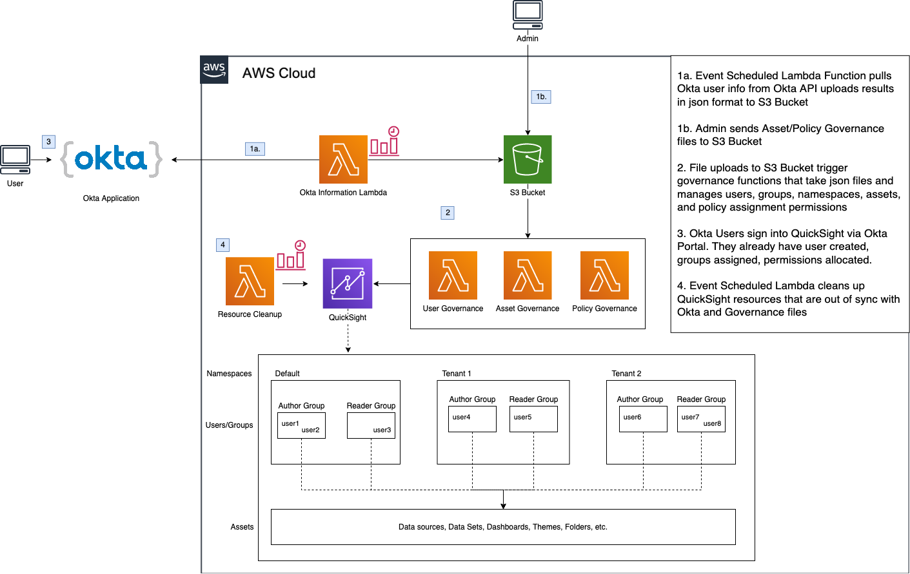

# Govern Amazon QuickSight with Okta

## Centrally manage QuickSight Namespaces, Groups, Users, and Assets while integrating with Okta

---

## Table of Contents

### 1. About

### 2. Architecture

### 3. Deployment and Set Up

### 4. Usage

### 5. Conclusion

### 6. Glossary

### 7. Extended Learning

---

## 1. About

The Problem: QuickSight lacks automated/reusable tools for user governance and asset governance

The Goal:

- Built in CDK for quick deployment and reusability
- Automates management of Users/Groups in QuickSight
- Simplifies Data Lake Access via Policy Manifest
- Automates Asset Governance by deriving permissions from Data Lake Access
- Failure Notifications and Reporting

The Solution:

- User Governance – manages creation/updates of all QuickSight user related resources (users, groups, namespaces)
- Asset Governance – governs access to QuickSight assets (dashboards, analyses, data sets)
- Policy Governance – manages access to the Data Lake (IAM policies and IAM Policy Assignments
- Resource Cleanup – manages deletion of removed users, groups, namespaces, IAM policies, IAM policy assignments.

---

## 2. Architecture



### Okta Group to QS User Role Mapping (Subject to Change)

| Okta Group | QuickSight Role |
|------------|--------------|
|qs_role_admin | ADMIN |
|qs_role_author | AUTHOR |
|qs_role_reader | READER |

All Other Okta Groups related to Quicksight will have prefix **qs_**

---

## 3. Set Up

### 1. Configuring QuickSight in your AWS Account for the First Time

#### a. [AWS Console] Sign Up For QuickSight Enterprise

Search for quicksight in the AWS Console search bar

Select sign up for quicksight

Select Enterprise Edition

provide a unique account name

provide notification email address

Important: Uncheck the box for Enable invitation by email. We DO NOT want users to be able to sign up via email. THIS SETTING CANNOT BE CHANGED AFTER SIGN UP.

Select Go to Amazon QuickSight

#### b. [AWS Console] Prevent New Users from Receiving Sample Data Sets

In QuickSight, as your Administrator, select Manage QuickSight in the top right menu

Select Account Customization

Uncheck the boxes for Show Introductory Videos and Create Sample Datasets and Analyses

#### c. [AWS Console] Update Security and Permissions for QuickSight

Select the Manage QuickSight top right menu

Select Security and Permissions

We want to DENY access to all services by default. Select Add or Remove

Check All Boxes for all Data Sources

For S3, Check Select All and give Write Permissions to Athena Group for the athena query result buckets

Select Finish

Select Update

Go back to Security and Permissions

Select Default Resource Access

Select Deny Access to All AWS Data and Resources to all users and groups

(we want to provide fine-grained access via IAM Policy Assignments instead

### 2. Connecting Okta and AWS

#### a. [Okta Console] Set up Okta Application

Sign in to your Okta admin dashboard. You can create a free Okta Developer Edition account if you don't have one.

From the Okta admin dashboard ribbon, choose Applications.

If you are viewing the Developer Console, switch to Classic UI.

Choose Add Application.

Search for Amazon Web Services and choose AWS Account Federation. Add.

Rename Application label to Amazon QuickSight and choose Next.

For Sign-On Options, choose SAML 2.0.

For Default Relay State, type https://quicksight.aws.amazon.com

Right-click on Identity Provider metadata and choose Save Link As…

you may need to manually edit the file to include the .xml extension

Save the XML file to disk and choose Done. You need to use this file in the next steps.

#### b. [AWS Console] Set up AWS Okta IDP

Create a SAML provider in AWS:

Open a new window and sign in to the AWS Management Console.

Open the IAM console.

In the navigation pane, choose Identity Providers, Create Provider.

For Provider Type, choose SAML and provide a Provider Name (for example, Okta).

For Metadata Document, upload the XML file from the previous steps.

Choose Next Step, Create.

Locate the IdP that you just created and make note of the Provider ARN

#### c. [Okta Console] Update IDP Arn

For Identity Provider ARN (Required only for SAML SSO), provide the ARN (for example, arn:aws:iam::<YOUR ACCOUNT ID>:saml-provider/okta-idp) of the IdP that you created in previous steps.

Choose Done.

#### d. [Okta Console] Retrieve the Okta Secret Information

Generate an Okta API Token

Security → API → Tokens → Create Token

Get Okta Account ID

ex. dev-123456abc

Get Okta App ID

Go to your Okta Application → General → Scroll Down to Embed Link → copy abcdefghijklmnop123456789

Use this information in the next step.

#### e. [AWS Console] Create the Secrets Manager Secret

Sign in to the AWS Secrets Manager console at https://console.aws.amazon.com/secretsmanager/

Choose Store a new secret.

Select Other type of secrets

Add Secret Key/Value pairs for each of the following Okta Information. You can find this information in your Okta account.

example:

okta-app-id-secret: abcdefghijklmnopqrst
okta-app-token-secret: abcdefghijklmnopqrstuv01234567890123456789
okta-account-id-secret: dev-01234567

click Next

provide Secret Name as okta-quicksight-secret

click Next, Store

### 3. Deploying CDK

#### a. [Local] Prepare the CDK

in the directory of this repository, navigate to cdk_modules/config.py

update the config file with information related to your AWS account:

(Account ID, Region, OKTA IDP, Secret name)

QuickSight Super User (who created QuickSight in the Account)

Okta Groups for QuickSight User Roles

#### b. [Local] Deploy the CDK

ensure your session is valid and you are using the correct AWS account profile.

```bash
export AWS_PROFILE=<insert>
export DEPLOYMENT_STAGE=dev
cd cdk_modules
source .env/bin/activate
cdk bootstrap aws://<account>/<region>
cdk deploy
```

#### c. [AWS Console] Create an AWS access key for Okta

To create an access key for Okta, follow these steps.

Open the IAM console.

Navigate to Users -> OktaSSOUser -> Security Credentials -> Create Access Key

To save your access key and secret key, choose Download .csv.

### 4. Configure the Okta application

#### a. [Okta Console] Update API Integration

From the Applications dashboard, choose Provisioning.

Choose Configure API Integration.

Select Enable API Integration.

For Access Key and Secret Key, provide the access key and secret key that you downloaded in previous steps.

Choose Test API Credentials, Save.

#### b. [Okta Console] Create Role Group and add Okta Users that will access QuickSight

Create Group in okta that looks like this:

aws_[account_id]_[FederatedRole]

ex: aws_012345678901_qs_gov_FederatedRole

Add all of your quicksight users to this role.

#### c. [Okta Console] Create QuickSight User Role Groups in Okta

qs_gov_role_admin for QUICKSIGHT ADMINS

qs_gov_role_author for QUICKSIGHT AUTHORS

qs_gov_role_reader for QUICKSIGHT READERS

#### c. [Okta Console] Update Group Mapping

From Applications Dashboard, choose Sign On.

Select Edit

Set the following values:

Group Filter: aws_(?{{accountid}}\d+)_(?{{role}}[a-zA-Z0-9+=,.@\-_]+)

Role Value Pattern: arn:aws:iam::${accountid}:saml-provider/<saml idp provider>,arn:aws:iam::${accountid}:role/${role}

Select Use Group Mapping

#### d. [Okta Console] Assign Groups to App

Choose Assignments, Assign and then select the groups to which to grant federated access.

Ensure to selct the Role Group. i.e. aws_[account_id]_[FederatedRole] that you created in the previous step.

Choose Save and Go Back, Done.

---

## 4. Usage

### 1. Administrator

#### a. Adding a new user to QuickSight

Create the user in Okta if it doesn't already exist.

Add the user to the aws_[account]_[federated_role] Okta group

Either manually run the GetOktaInfo Lambda Function or wait for the fixed schedule to sync Okta and QuickSight Users. This process will create new users in QuickSight.

#### b. Creating and Managing QuickSight Groups

A GetOktaInfo Lambda Function will pull Okta Group information based on the prefix specified in cdk_modules/config.py

For example, if your prefix is qs_gov ... then any group in Okta with that prefix will be created in QuickSight.

Okta users in the qs_gov_[group name] will be automatically assigned to those groups in QuickSight.

Either manually run the GetOktaInfo Lambda Function or wait for the fixed schedule to sync Okta and QuickSight Users. As previously stated, this process will create new QuickSight groups and add QuickSight users to those groups.

#### c. Assigning a QuickSight Role

##### 1. Add the Okta User to the respective Okta Group:

example:

qs_gov_role_admin for QUICKSIGHT ADMINS

qs_gov_role_author for QUICKSIGHT AUTHORS

qs_gov_role_reader for QUICKSIGHT READERS

The user will automatically be given a role based on the role group they are in. If a user is in more than one group, it will assign the user with the highest level.

##### 2. Either manually run the GetOktaInfo Lambda Function or wait for the fixed schedule to sync Okta and QuickSight Users. This process will automatically assign users their QuickSight Role based on the Okta Group they are in

#### d. Managing QuickSight IAM Policy Assignments

IAM Policy assignments are great for fine-grained access to the Data Lake. Use Case: The Finance Group only needs access to Finance-related Glue Databases and Glue Tables. Use an IAM Policy Assignment to restrict them to only what they need.

QuickSight IAM Policy Assignments are managed by Policy Manifest Files. Here is an example:

```json
{
    "policies":[
       {
            "group": "qs_gov_dev_group_pandora",
            "namespace": "default",
            "databases": [
                {
                    "name": "pandora_dev",
                    "tables": [
                        "payment_execution_service",
                        "scheduled_payments",
                        "payment_scheduler_vendor_reports"
                    ]
                }
            ]
       }
    ]
}
```

Key:

**group**: the QuickSight Group that will be given IAM Policy Assignment

**namespace**: the QuickSight namespace that the QuickSight group resides in

**databases**: A list of Glue Databases / Tables

**databases.name**: The name of the Glue Database that this QuickSight group needs to access

**databases.tables**: A list of Glue Tables that this QuickSight group needs to access

What do you do with this file? Add it to the QuickSight Governance Bucket in the following location:

s3://<bucket-name>/qs_gov/policies/

When the file lands in S3, it triggers a Lambda Function that will:

Create a brand new IAM Policy that provides access to the Glue Database and Glue Tables specified in the policy

Create an IAM Policy Assignment that gives the IAM policy to a QuickSight Group

*Note: IAM Policy Assignments delegate all permissions for users, groups, etc.  This is their access to the data lake. Users can only see Data Sets, Analyses, and Dashboards that contain data from the data lake that they have access to. In other words, if they are given a Dashboard that contains data from a table that they DO NOT have permission to, this Dashboard access will be revoked.*

#### e. Start to Finish Workflow for Admin

User is registered in Okta

Administrator adds User to the QuickSight federated role group

Administrator adds User to a QuickSight User Role Group (admin, author, reader)

Administrator creates new group or adds User to existing org group (such as qs_gov_pandora)

Administrator modifies or creates a manifest file for Asset Permissions and Policy assignments for that new/existing Okta QuickSight Group and uploads them to S3

### 2. Author

#### a. Log In

Log in to Okta

Launch QuickSight app named “Amazon QuickSight”

#### b. Get Access

Data Lake Permissions are derived from your Okta Groups. (i.e. Okta Group qs_gov_group_finance might have access to the finance data). If a user / group does not have Athena access to underlying data, then access to QuickSight assets will be revoked

To Get Access, talk to your administrator

#### c. Authoring

As an author, you'll have the ability to create Data Sets, Analyses, and Dashboards.

After logging in, select Data Sets on the left pane.

Create New Data Set.

Scroll down to Existing Data Sources and select AthenaMain

Permissions to the Data Lake are assigned by your Okta Groups. Talk to your Administrator about which groups you need to be in

Select your Catalog, Database, and Table. or, alternatively, select Use Custom SQL

From here, you can either Directly Query or load data into SPICE for faster analytics.

You can Edit/Preview Data or Save and Visualize.

#### d. Sharing Data Sets

Any Data Set you share is subject to Governance (see Glossary). If a data set is shared to a user that doesn’t have access to the underlying data, that data set access will be revoked and you will be notified via email.

After creating a Data Set, it will appear in the Data Sets list. (found via menu on the left)

Select any Data Set in the list

Select Share

Select Invite Users

You have the option to share Data Sets. There are restrictions to sharing:

“Share with group” - if any user in the group doesn’t have access to underlying data, this will be revoked.

“Share with user” - if this user doesn’t have access to underlying data, this will be revoked

#### d. Sharing Analyses

Any Analysis you share is subject to Governance (see Glossary). If an analysis is shared to a user that doesn’t have access to the underlying data, that analysis access will be revoked and you will be notified via email.

After creating a Data Set, you can create an Analysis.

On the Analysis page, Select Share in the top right menu.

Select Share Analysis

Select Manage Analysis Permissions

Select Invite Users

You have the option to share Analyses. There are restrictions to sharing:

“Share with group” - if any user in the group doesn’t have access to underlying data, this will be revoked.

“Share with user” - if this user doesn’t have access to underlying data, this will be revoked

#### d. Sharing Dashboards

Any Dashboard you share is subject to Governance (see Glossary). If a dashboard is shared to a user that doesn’t have access to the underlying data, that dashboard access will be revoked and you will be notified via email.

After creating a Data Set and an Analysis, you can build Dashboards.

On the Analysis page, Select Share in the top right menu.

Select Publish Dashboard

You have the option to share Published Dashboards. There are restrictions to sharing:

“Share with everyone in this account” - if any user doesn’t have access to underlying data, this will be revoked.

“Share with group” - if any user in the group doesn’t have access to underlying data, this will be revoked.

“Share with user” - if this user doesn’t have access to underlying data, this will be revoked.

### 3. Reader

#### a. Log In

Log in to Okta

Launch QuickSight app named “Amazon QuickSight”

#### b. Get Access

Data Lake Permissions are derived from your Okta Groups. (i.e. Okta Group qs_gov_group_finance might have access to Finance data). If a user / group does not have Athena access to underlying data, then access to QuickSight assets will be revoked

To Get Access to certain dashboards / datasets, talk to your administrator.

---

## 6. Glossary

**Okta** - the main source of identity management. enterprise-grade, identity management service, built for the cloud, but compatible with many on-premises applications. With Okta, IT can manage any employee's access to any application or device.

**Amazon QuickSight** - cloud-scale business intelligence (BI) service that you can use to deliver easy-to-understand insights to the people who you work with, wherever they are. Amazon QuickSight connects to your data in the cloud and combines data from many different sources.

**Data Lake** - the AWS S3/Glue Data Lake that holds all your analytical data

**QuickSight Governance Solution** - the custom built solution that ties Okta, QuickSight, and the Data Lake together. Allows Identity Management in QuickSight to be managed via Okta. Allows QuickSight Asset permissions to be derived from a user or group’s Data Lake access.

*User* - a user is an individual in Okta that has been mapped (created) to QuickSight. Since QuickSight utilizes its own identity management, the QuickSight Governance Solution maintains the 1:1 user mapping between Okta and QuickSight.

**Group** - a group exists in Okta and can hold any number of Okta users. Okta Groups with the prefix 'qs_gov' will be automatically mapped to QuickSight. the QuickSight Governance Solution maintains the 1:1 group mapping between Okta and QuickSight.  Groups are the main vehicle for permissions in QuickSight. Groups are given fine-grained access to the Data Lake by an admin

**QuickSight User Role** - every QuickSight user is given a User Role. This can be ADMIN, AUTHOR, or READER.

**QuickSight ADMIN** - a QuickSight super user. Capable of any QuickSight action and can even manage other QuickSight users. Admins also inherit permissions of READER and AUTHOR.

**QuickSight AUTHOR** - a QuickSight creator. Builds QuickSight Assets such as Data Sets, Analyses, and Dashboards for business intelligence and reporting. Can share these QuickSight Assets with other QuickSight users. Authors also inherit permissions of READER.

**QuickSight READER** - a QuickSight consumer. Can only view the QuickSight Dashboards that are shared with the user. Cannot create anything.

**QuickSight Asset** - a QuickSight Data Set, Analysis, or Dashboard. These are the main reporting components in QuickSight. Typical workflow consists of creating a QuickSight Data Set, creating QuickSight Analyses from that QuickSight Data Set, and then publishing QuickSight Dashboards that consist of a collection of QuickSight Analyses.

**QuickSight Data Source** -  the literal connection of QuickSight to a data storage in AWS. In most cases, this will be Amazon Athena.

**QuickSight Data Set** -  a table or custom sql query joining multiple tables of data. This data is then either directly queried or loaded into QuickSight SPICE. QuickSight Analyses are built from QuickSight Data Sets. Can be shared with other ADMINs, AUTHORs, or Groups.

**QuickSight Analysis** -  a collection of visualizations on a QuickSight Data Set. Can be shared with other ADMINs, AUTHORs, or Groups.

**QuickSight Dashboard** - a published final product of one or more QuickSight analyses. These are shared with other ADMINs, AUTHORs, READERs, or Groups.

**QuickSight Direct Query** - a way of accessing Data Lake tables for Analyses. A Direct Query will use Athena to query the Data Lake every time you load a QuickSight Analysis. (usually slower than SPICE)

**QuickSight SPICE** - a way of accessing Data Lake tables for Analyses. Data loaded into SPICE will be loaded directly into Amazon QuickSight for much faster data access. There is a limit to how much data can be loaded into SPICE for a given QuickSight account.

**QuickSight IAM Policy Assignment** - a way of assigning an IAM Policy to a QuickSight group. Permissions to the Data Lake are assigned via IAM Policies.

**Governance** - when a User’s permissions to a QuickSight Asset are validated by determining if that User has access to the data that comprises that QuickSight Asset. ex) if a QuickSight Dashboard containing finance data is shared with a User in Engineering, then that user’s permissions to the QuickSight Dashboard will be revoked. (since they don’t have access to finance data in the Data Lake)

---

## 7. Extended Learning

### Cross-Account QuickSight Access

- 
- 
- 

### QuickSight Namespaces

- 
- 
- 

### QuickSight + Okta

- 
- 
- 

### Okta Attribute Mapping

- 
- 
- 

### Okta API Usage

- 
- 
